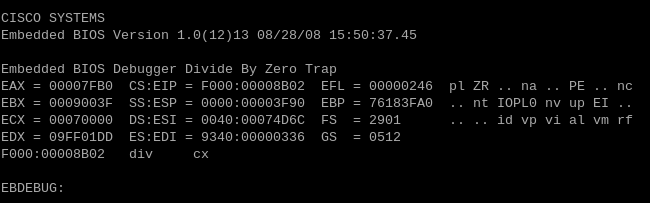

# Breaking The Bootloader

While looking online initially to see if others had done something similar, I came across the following articles: 

- [Rapid7](https://www.rapid7.com/blog/post/2016/06/14/asa-hack/)
- [NCC Group](https://www.nccgroup.com/us/research-blog/cisco-asa-series-part-one-intro-to-the-cisco-asa/)

## MODIFYING ASA FIRMWARE IMAGES FOR ROOT SHELL

The first article caught my eye as it showcased how easy it would be to modify an ASA OS image to boot into a root shell. According to their guide, all you had to do was load the firmware image in a hex editor, update some linux kernel parameters (it used linux?), load the firmware on the device, and power it on. In doing so, you were able to access a root shell that provided access to the system before the Lina binary was able to take over.

However, I wasn't able to find much use for it here as I was only gaining access to the rootfs image (essentially looking at the base for a ramdisk). Busybox provided a lot of utilities for use there (and Lina was accessible for debugging) but I couldn't really find much else there. 

## DISCOVERING A DEBUG SCREEN

In finding that article, I was able to find the second article and pull up the NCC Group and the research they had done into the ASA Lina binary close to 10 years before. While most of it is irrelevant from the point of view of this project (they only debugged the Lina binary), I did come across a very minor comment (in the **Convenience Tips** section) that opened another avenue:

> While replacing a CF card that was malfunctioning, we noticed that the ASA 5505 (and likely other models as well) appears to have an 8GB size limit for CF cards. Inserting a 16GB CF card will simply cause the BIOS to fail POST. This size limit doesn’t appear to be well documented and we didn’t investigate further. Interestingly this drops you to an extended BIOS debug (EBDEBUG) shell (which doesn’t seem to be well documented).

In wanting to try and replicate this, I purchased a 16 GB CF card, inserted it into the ASA, and was quickly able to force the system to boot to a BIOS-level debugger: 

A quick Google search of the prompt for the shell (called **EBDEBUG**) led me to the [BIOS documentation](/references/bios_documentation/Embedded%20BIOS%204.3%20for%20X86%20-%20x86-ebios-43.pdf) that's listed in this repo.

With reading into the documentation and utilizing [OSDev.com](https://wiki.osdev.org/Expanded_Main_Page) to get an better understanding of real-mode, interrupts, and the low-memory model, I realized that the debugger provided me with alot to understand the hardware. This included the ability to execute instructions directly against it, moving across memory by adjusting the EIP register, and even with reading/writing to flash storage.

While I've made use of the debugger over the course of this project, I've not made a lot of attempts to run custom code through it as the debugger doesn't work as a suitable bootstrapper as it's not automatic on powerup. Though, I'm still considering this for the fun of it and for the original goal of the project.