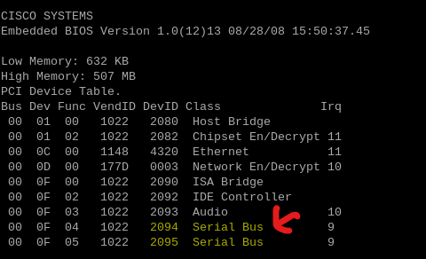

# Board Debugging Interface Exploitation

In following the attached guide [here](/hardware_hacking_references/Hardware.Hacking.Methodology-Jeremy.Brun-v1.0.pdf), I looked into multiple interface exploits that I could use to gain full access. These are documented below:

## UART

UART (Universal Asynchronous Receiver-Transmitter) is a serial protocol/interface that's commonly found on embedded devices. I got hooked on looking for one of these interfaces when I realized that alot of embedded devices (newer ones mind you) provide a root shell through it. While I didn't think Cisco was going to provide an easy entry point (and given this device was using 20-year old hardware), I delved into it regardless.

Originally, I tried to voltage test some of the easily-visible [pinhole patterns](../hardware/board_if_pinouts.md) for UART connectivity but that led me knowhere. I wasn't able to clearly identify the Vcc, TX, and RX pins as the voltage seemed to stay consistent at 3.3 volts and didn't seem to fluctuate much within one single pin on bootup. That behavior was key as a higher fluctuating boot voltage could be indicative of the system outputting lots of bootup logs.

While I wasn't able to find much at the time, I delved further when I realized that the following shows in the ROMMON firmware startup:

As two serial interfaces were detected (with only one physically accessible from an external port), I started looking at other unidentified pins/pads on the board. Several hours and one bricked Raspberry PI UART adapter later (my bad), I ultimately looked at the balls on the MCU directly. This seemed to be a good entry point as I had gotten access to the chip's documentation beforehand and discovered that it documented the chip balls used for UART connectivity.

**Note: See next section for more information on JTAG**

With that in mind, it was only a matter of discovering the orientation of the chip on the board. This was easily done by looking at the mirror image of the diagrammed chip on the back of the board (with the AMD marking right side up when looking at the front):

**Note: See next section for more information on JTAG**

In identifying the labeled pins, I potentially had something. While I was able to pick up the primary console's connection (using a newer Raspberry PI 5 and minicom) via the GPIO8 and GPIO9 pins, the other pins seemed dead. While GPIO3 and GPIO4 were reserved for the secondary connection in the documentation, I was able to detect little-to-no voltage on those two pins. I connected to the other labeled GPIO pins to rule those out and eventually came to the conclusion that it was locked down (or disabled in firmware) and would require board modifications that I wouldn't be comfortable with.

## JTAG

While disassembling the device originally, I came across a series of pins (curiously hidden under a barcode) that I thought were originally a place where I could solder VGA pins. At the time, I was thinking this model just didn't have them like the others did. 

However, upon some Google research and the attached guide, I determined that it actually resembled a [**JTAG**](../hardware/board.md) interface (see #3), an interface standard that came out in the late 80s/early 90s to simplfy board testing. While that was it's primary use, the interface also had the benefit in it provided access to all of the signals on all traces on the device's motherboard.

The potential usage of a JTAG connector came to an end fairly quickly though when I realized that finding hardware/software with compatibility for x86 MCUs was going to be problem. This seemed to be the case as much of the embedded engineering/hardware hacking community has moved on to other architectures. 

In addition, I couldn't identify a potential [pinout](http://www.jtagtest.com/pinouts/) for the interface and I eventually discovered that only the TDO input pin wasn't connected (see diagram photo above). With that in mind, this got pushed to the back burner due to the potential costs needed for such a small hobby project.